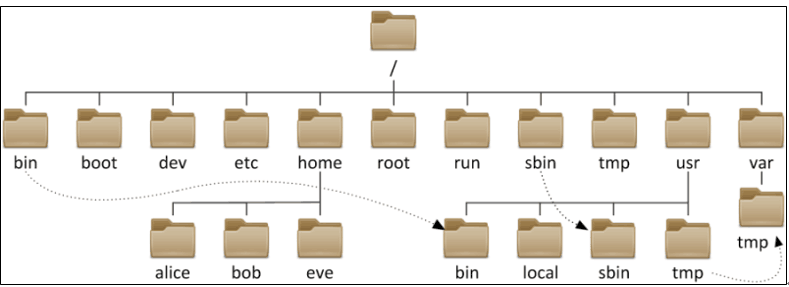

#### 教学监督热线：400-1567-315

### LINUX的初识

#### 知识要点

1. 基本认知
2. 创建用户
3. 目录操作
4. 文件类型及操作

主要命令：cd , ls , mkdir , rmdir ,  touch ,  rm  ,cp , cat , mv


### 命令提示符

`[root@taka ~]# `

格式：`[用户@主机名 当前目录]#`

`root `是`Linux`管理员，也称为超级用户。

这里的`taka`是主机名。

`~`是当前用户的家目录，家目录就相当于我们`window`系统中的桌面。

`#`是超级用户的提示符，`$`是普通用户的提示符。

命令：`pwd`  当前目录  、`hostname` 主机名、`whoami`  当前用户

```
[root@taka ~]# pwd
/root
[root@taka ~]# hostname
taka
[root@taka ~]# whoami
root
[root@taka ~]# 
```

### 创建普通用户

```
[root@taka ~]# useradd taka
[root@taka ~]# passwd taka
更改用户 taka 的密码 。
新的 密码：
无效的密码： 过短
无效的密码： 过于简单
重新输入新的 密码：
passwd： 所有的身份验证令牌已经成功更新。
[root@taka ~]# 
```

### 为普通用户添加sudo权限

`[root@taka ~]# visudo`

`visudo` 打开文件后，将`username ALL=(ALL)  ALL `加入到文件中。具体步骤：

1.visudo进入文件。

2.按上下键找到`root    ALL=(ALL)       ALL` 这一行内容。

3.按 i 键进入插入模式，然后输入`username ALL=(ALL)  ALL ` 。

4.输入完成后，按Esc，然后shift+;   ,末行出现冒号后输入wq回车来保存退出。

### 目录操作

#### 跳转目录`cd 命令` 

常见用法：

```
cd 绝对路径
cd 相对路径
cd .. 回到上一级目录
cd / 跳到根目录
cd ~ 回到家目录
cd   回到家目录
cd . 当前目录
cd - 回到上一次目录
```

查看目录内容的命令配合着cd命令一起学习

```
ls 查看当前目录中的内容
ll 详细列出当前目录中的内容
```

目录结构：

```
Linux和Windows最大的不同之处在于Linux的目录结构的设计，在Linux中，任何文件，目录和设备都在根目录“/”之下。Linux把所有文件和设备都当作文件来管理，这些文件都在根目录下，同时Linux中的文件名区分大小写。
```



```
~家目录
/根目录  从逻辑上说系统中的所有一切都隶属于它
/bin		--存放所有用户都能执行的命令（二制文件）
/boot		--存放启动文件/内核的相关文件，一般独立成为一个分区。
/dev		--存放物理设备的目录
/etc		--存放配置文件
/home		--用户的家目录
/lib		--32位库文件
/lost+found	--分区修复时找回来的文件会存放在这里,
              存放一些系统不正常关机的的文件残片
/media		--专门用于挂载的目录
/misc		--autofs备用文件夹
/mnt		--专门用于挂载的目录
/opt		--用于存放第三方软件可选目录
/proc		--当前内核的映射，一个虚拟的文件系统
/root		--管理root的家目录
/sbin		--管理员才能够执行的命令  root
/selinux	--selinux安全策略相关的文件
/sys		--内核在内存中的映像文件
/tmp		--临时目录，建议独立划成分区
/usr		--用于存放第三方软件
/var		--存放日志或者频繁修改的文件
```

##### 创建/删除目录`mkdir` `rmdir` 

mkdir 新建目录   ；mkdir  -p 新建多级不存在目录

rmdir 删除空目录 ；rmdir -p 删除多级空目录

```
[taka@taka ~]$ mkdir a
[taka@taka ~]$ ls
a
[taka@taka ~]$ mkdir /home/taka/b
[taka@taka ~]$ ls
a  b
[taka@taka ~]$ mkdir c/d
mkdir: 无法创建目录"c/d": 没有那个文件或目录
[taka@taka ~]$ mkdir -p c/d
[taka@taka ~]$ ls
a  b  c
[taka@taka ~]$ ls c
d
[taka@taka ~]$ rmdir a
[taka@taka ~]$ ls
b  c
[taka@taka ~]$ rmdir -p c/d
[taka@taka ~]$ ls
b
[taka@taka ~]$ 
```

##### 创建/删除文件`touch` `rm` 

`touch filename` 创建文件或修改文件时间

文件类型:

```
b      块文件也叫设备文件也叫特殊文件
c      字符文件
d      目录文件
p      管道文件
f(-)   普通文件／文本文件
l      链接文件
s(socket)      unix/类unix套接字
```

注意：linux上文件的后缀名只是给我们自己看的，并不能表示文件的类型。

`rm` 删除文件或目录

```
rm -i 删除前提示用户进行确认
rm -r 删除指定目录及目录下的所有文件
rm -f 强制删除，没有提示确认
```

例子：

```
[taka@taka ~]$ ls
b
[taka@taka ~]$ touch ff1
[taka@taka ~]$ touch ff2 ff3
[taka@taka ~]$ touch b/ff4
[taka@taka ~]$ ls
b  ff1  ff2  ff3
[taka@taka ~]$ ls b
ff4
[taka@taka ~]$ rm ff1
[taka@taka ~]$ rm -i ff2
rm：是否删除普通空文件 "ff2"？y
[taka@taka ~]$ ls
b  ff3
[taka@taka ~]$ rm b
rm: 无法删除"b": 是一个目录
[taka@taka ~]$ rm -r b
[taka@taka ~]$ ls
ff3
[taka@taka ~]$ 
```

##### 复制/移动文件`cp` `mv`

`cp` 复制文件或目录，默认情况下，cp命令不能复制目录，如果要复制目录，则必须使用-r选项；

`mv` 对文件/目录重命名或移动文件

`cat`获取文件内容

```
[taka@taka ~]$ mkdir a b
[taka@taka ~]$ ls
a  b
[taka@taka ~]$ cp /etc/passwd a
[taka@taka ~]$ ls a
passwd
[taka@taka ~]$ cp a/passwd a/shishi
[taka@taka ~]$ cp a b
cp: 略过目录"a"
[taka@taka ~]$ cp -r a b
[taka@taka ~]$ ls a
passwd  shishi
[taka@taka ~]$ ls b/a
passwd  shishi

[taka@taka ~]$ mv a/passwd ff1
[taka@taka ~]$ ls
a  b  ff1
[taka@taka ~]$ mv ff1 pass
[taka@taka ~]$ ls
a  b  pass
[taka@taka ~]$ 
```

安装`man`命令:

```
sudo yum install man
```

```
clear 清屏
Ctrl+ L

shutdown 关机
shutdown -h now
reboot 重启系统
```